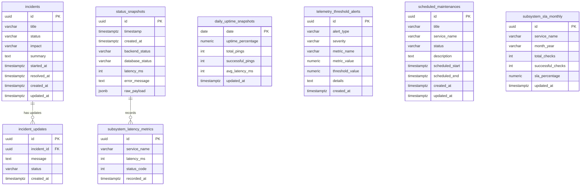

# Entity Relationship Diagram & Schema Document (ERD)
## Zerpai Status Page Telemetry Engine

---

## 1. Database Entity Relationship Diagram

---

## 2. Table Specifications

### 2.1 Table: `status_snapshots`
- **Purpose**: Stores periodic full system health snapshots emitted by background probes.
- **Columns**:
  - `id`: `UUID PRIMARY KEY DEFAULT gen_random_uuid()`
  - `timestamp`: `TIMESTAMPTZ NOT NULL DEFAULT NOW()`
  - `created_at`: `TIMESTAMPTZ NOT NULL DEFAULT NOW()`
  - `backend_status`: `VARCHAR(20) NOT NULL` ('operational', 'degraded', 'outage')
  - `database_status`: `VARCHAR(20) NOT NULL`
  - `latency_ms`: `INT NOT NULL DEFAULT 0`
  - `error_message`: `TEXT NULL`
  - `raw_payload`: `JSONB NULL` (Contains nested details for ECS, RDS, Redis, Cognito, CloudFront, Bastion)

### 2.2 Table: `daily_uptime_snapshots`
- **Purpose**: Aggregated 90-day daily uptime history used to build the uptime bar grid.
- **Columns**:
  - `date`: `DATE PRIMARY KEY`
  - `uptime_percentage`: `NUMERIC(5, 2) NOT NULL DEFAULT 100.00`
  - `total_pings`: `INT NOT NULL DEFAULT 0`
  - `successful_pings`: `INT NOT NULL DEFAULT 0`
  - `avg_latency_ms`: `INT NOT NULL DEFAULT 0`

### 2.3 Table: `subsystem_sla_monthly`
- **Purpose**: Tracks monthly uptime compliance percentages per subsystem against target SLAs.
- **Columns**:
  - `id`: `UUID PRIMARY KEY DEFAULT gen_random_uuid()`
  - `service_name`: `VARCHAR(100) NOT NULL`
  - `month_year`: `VARCHAR(7) NOT NULL` (e.g. `'2026-09'`)
  - `total_checks`: `INT NOT NULL DEFAULT 0`
  - `successful_checks`: `INT NOT NULL DEFAULT 0`
  - `sla_percentage`: `NUMERIC(5, 2) NOT NULL DEFAULT 100.00`
  - **Constraints**: `UNIQUE(service_name, month_year)`
