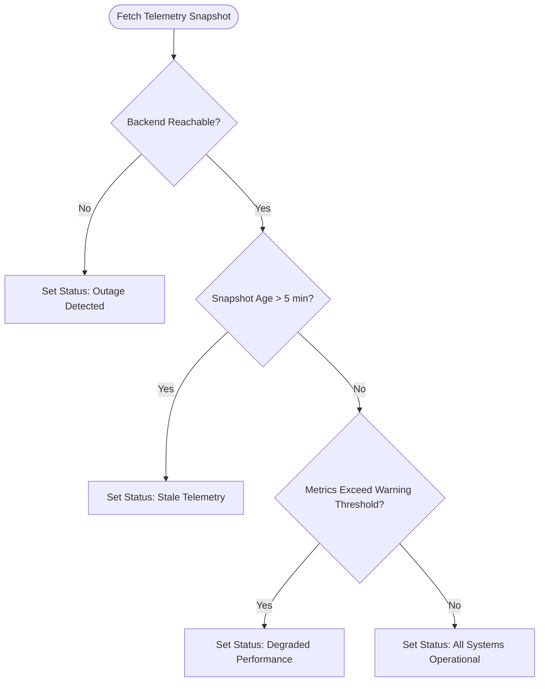

# Functional Requirements Document (FRD)
## Zerpai Infrastructure Status Monitor

---

## 1. Functional Scope & Feature Matrix

| Req ID | Module / Component | Functional Requirement | Priority | Status |
| --- | --- | --- | --- | --- |
| **FR-01** | Status Hero Banner | Render real-time status banner (`All Systems Operational`, `Degraded Performance`, `Outage Detected`). | Critical | Implemented |
| **FR-02** | Telemetry Metrics Grid | Display 4 KPI cards: DB Query Latency, RDS Class, Freeable RAM, CPU Utilization. | High | Implemented |
| **FR-03** | Subsystem Component Cards | Render 6 cloud infrastructure component health rows with operational badges. | Critical | Implemented |
| **FR-04** | Monthly SLA Breakdown | Display 6-component grid tracking monthly availability percentages vs 99.9% target. | High | Implemented |
| **FR-05** | 90-Day Historical Bar | Render 90 daily vertical bar charts with date tooltips and ping statistics. | High | Implemented |
| **FR-06** | Incident Log | Display active and historical incident records with update timeline notes. | Medium | Implemented |
| **FR-07** | Maintenance Announcement | Render alert banner for active/upcoming scheduled maintenance windows. | Medium | Implemented |
| **FR-08** | Threshold Warning Feed | Display resource exhaustion and telemetry threshold warning alerts log. | Low | Implemented |
| **FR-09** | Auto-Refresh Control | Interactive toggle enabling 5-second client-side polling with pause option. | High | Implemented |
| **FR-10** | Manual Refresh Button | Trigger instant re-fetch of `/api/overview` with loading spinner indicator. | High | Implemented |

---

## 2. Status Evaluation Control Flow

