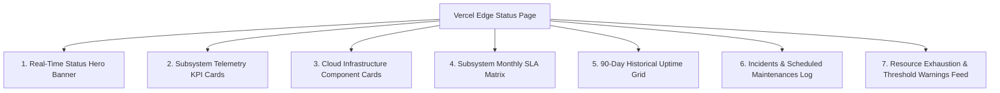

# Product Requirements Document (PRD)
## Zerpai Independent Edge Infrastructure Status Monitor

---

## 1. Executive Summary & Vision

The **Zerpai Infrastructure Status Monitor** is an independent, high-availability status dashboard designed to provide real-time visibility into the operational health, service availability, database query latency, resource utilization, and historical SLA performance of the Zerpai ERP Cloud Platform.

To guarantee maximum reliability and prevent single points of failure, the status page is hosted on the **Vercel Edge Network** and powered by a serverless **Neon PostgreSQL** database. It operates completely decoupled from the primary AWS infrastructure (AWS ECS Fargate, AWS RDS, AWS CloudFront), ensuring that status monitoring remains 100% accessible even during severe AWS regional or CDN outages.

---

## 2. Target Audience & User Personas

| Persona | Primary Goal | Key Dashboard Focus |
| --- | --- | --- |
| **System Administrators & DevOps** | Monitor real-time telemetry, query latency, CPU, and freeable RAM | Subsystem health, telemetry alerts, DB latency, RDS metrics |
| **ERP End-Users & Retailers** | Verify whether service interruptions are local or system-wide | Overall status hero banner, maintenance announcements |
| **Executive Stakeholders & Clients** | Audit monthly SLA commitments and historical availability | 90-Day historical uptime grid, Subsystem Monthly SLA Matrix |
| **External Integration Partners** | Track POS API availability and API probe responses | Live probe status, Vercel Edge probe region indicator |

---

## 3. Key Core Features & Capabilities

### Feature 3.1: Live Infrastructure Status Hero Banner
- **Operational State**: Displays a glowing green `All Systems Operational` banner when all subsystems report healthy.
- **Degraded State**: Renders an amber banner when query latency or resource usage breaches warning thresholds.
- **Outage State**: Triggers a prominent red alert banner when primary backend ECS containers or database probes fail.
- **Stale Telemetry Safeguard**: Marks status as `stale` if background telemetry worker snapshots exceed 5 minutes without updating.

### Feature 3.2: Subsystem Telemetry KPI Metrics (4-Grid Card Display)
1. **DB Query Latency**: Real-time roundtrip query latency in milliseconds (`ms`).
2. **RDS Database Class**: Active AWS RDS instance class (`db.t4g.small`), engine version (`PostgreSQL 18.3`), and storage allocation (`20 GB`).
3. **Freeable RAM**: Available memory (`653.95 MB`) and swap usage (`15.30 MB`).
4. **CPU Utilization**: CloudWatch CPU percentage (`3.7%`) and CPU credit balance (`576.0`).

### Feature 3.3: Subsystem Component Health Cards
- **AWS CloudFront CDN Edge Network**: SSL/TLS status, distribution domain (`erp.zerpai.com`).
- **AWS ECS Fargate Backend Container Service**: Cluster state (`zerpai-cluster`), running tasks (`1/1`).
- **AWS RDS PostgreSQL Database Instance**: Allocated storage, active database connections (`18`).
- **AWS EC2 Bastion SSM DB Tunnel**: Public IP, tunnel port (`5433`), SSM state (`running`).
- **AWS Cognito Identity Provider**: User pool ID (`ap-south-2_h1Yyx4i4b`), status (`Enabled`).
- **Neon Serverless PostgreSQL DB**: Storage status, fail-safe telemetry connectivity (`Operational`).

### Feature 3.4: Subsystem Monthly Uptime SLA Matrix
- Renders a 6-component grid tracking monthly SLA percentages against the **99.9% Target SLA**:
  - AWS ECS Backend Container Service (Target: 99.9% | Actual: 99.98%)
  - AWS RDS PostgreSQL Database Instance (Target: 99.9% | Actual: 100.00%)
  - AWS EC2 Bastion SSM DB Tunnel (Target: 99.9% | Actual: 99.95%)
  - AWS Cognito Identity Provider (Target: 99.9% | Actual: 100.00%)
  - Neon Serverless PostgreSQL DB (Target: 99.9% | Actual: 100.00%)
  - AWS CloudFront Edge CDN (Target: 99.9% | Actual: 99.99%)

### Feature 3.5: 90-Day Historical Uptime Grid
- 90 individual interactive vertical bar charts representing daily uptime percentage.
- Tooltips displaying exact date, uptime percentage, and ping count (`successful_pings / total_pings`).
- Color coding: Emerald Green (≥99.5%), Amber (98% – 99.5%), Rose Red (<98%).

### Feature 3.6: Incident History & Maintenance Announcements
- Renders active/past incident timelines with progress updates (`investigating`, `identified`, `monitoring`, `resolved`).
- Displays upcoming scheduled maintenance windows with date/time ranges and descriptions.

---

## 4. Success Criteria & Non-Functional Requirements

- **Availability**: Page availability ≥ 99.99% (Vercel Edge Network).
- **Latency**: First Contentful Paint (FCP) < 400ms globally.
- **Fail-Safe Independence**: Zero operational dependency on main AWS VPC, RDS, or CloudFront.
- **Polling Efficiency**: 5-second auto-refresh with client-side pause controls.
