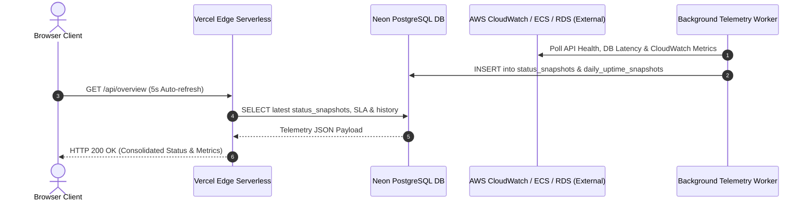

# Technical Requirements Document (TRD)
## Zerpai Independent Edge Infrastructure Status Monitor

---

## 1. System Architecture & Component Interactions



---

## 2. API Contract Specifications

### 2.1 Consolidated Overview Route
- **Endpoint**: `GET /api/overview`
- **Cache Policy**: `force-dynamic`, `revalidate: 0`
- **Response Format**:
  ```json
  {
    "status": {
      "overallStatus": "operational",
      "timestamp": "2026-09-30T10:44:21.000Z",
      "environment": "production",
      "region": "ap-south-2",
      "source": "neon_db_authoritative_snapshot",
      "snapshotAgeMs": 14200,
      "services": {
        "cloudfront": { "status": "operational", "details": {} },
        "ecs": { "status": "operational", "details": {} },
        "rds": { "status": "operational", "details": {} },
        "ec2_bastion": { "status": "operational", "details": {} },
        "cognito": { "status": "operational", "details": {} },
        "redis": { "status": "operational", "details": {} },
        "neon_db": { "status": "operational", "details": {} }
      }
    },
    "history": [
      {
        "date": "2026-09-29T18:30:00Z",
        "total_pings": 8640,
        "successful_pings": 8640,
        "uptime_percentage": "100.00",
        "avg_latency_ms": 533
      }
    ],
    "incidents": [],
    "sla": [
      { "service_name": "AWS ECS Backend Container Service", "sla_percentage": "99.98", "month_year": "2026-09" },
      { "service_name": "AWS RDS PostgreSQL Database Instance", "sla_percentage": "100.00", "month_year": "2026-09" },
      { "service_name": "AWS EC2 Bastion SSM DB Tunnel", "sla_percentage": "99.95", "month_year": "2026-09" },
      { "service_name": "AWS Cognito Identity Provider", "sla_percentage": "100.00", "month_year": "2026-09" },
      { "service_name": "Neon Serverless PostgreSQL DB", "sla_percentage": "100.00", "month_year": "2026-09" },
      { "service_name": "AWS CloudFront Edge CDN", "sla_percentage": "99.99", "month_year": "2026-09" }
    ],
    "maintenances": [],
    "alerts": [],
    "timestamp": "2026-09-30T10:44:21.000Z"
  }
  ```

### 2.2 Live Telemetry Lightweight Route
- **Endpoint**: `GET /api/status`
- **Purpose**: Low-overhead endpoint used for client-side 5-second polling loop (`fetchLiveStatusOnly`).

---

## 3. Schema management

Schema is provisioned through reviewed `migrations/0001_status_page_schema.sql`, never by request handlers. Existing tables must be present before deploying.

## 4. Freshness and reporting

- Both status read routes mark component observations older than five minutes stale.
- Unknown/stale evidence never produces a green status banner or synthetic SLA rows.
- Monthly percentages count authoritative service observations, excluding unknown/stale states; they do not establish continuous contractual SLA coverage.
- Daily history uses explicit UTC date strings. Zero percent remains zero; missing days stay unverified.
- Overview refreshes every minute; the status snapshot refreshes every five seconds. Failed reads display an error and unverified badges.

## 5. Collection

The secret-free cron route and supervised daemon share `executeTieredProbe` in `functions/probe-worker.ts`. The daemon executes every 60 seconds; Vercel's daily cron is a fallback. Independent scheduling requires an always-on host. A worker function URL alone is not a scheduler.
