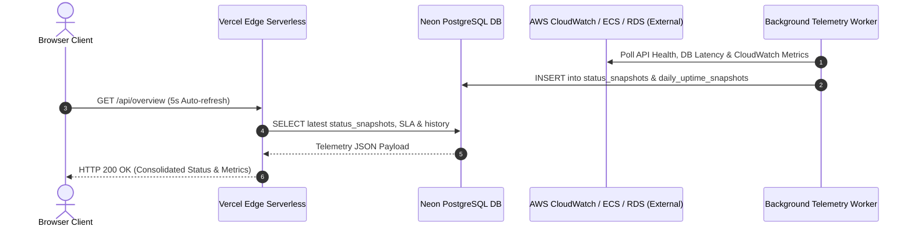

# Technical Requirements Document (TRD)
## Zerpai Independent Edge Infrastructure Status Monitor

---

## 1. System Architecture & Component Interactions



---

## 2. API Contract Specifications

### 2.1 Consolidated Overview Route
- **Endpoint**: `GET /api/overview`
- **Cache Policy**: `force-dynamic`, `revalidate: 0`
- **Response Format**:
  ```json
  {
    "status": {
      "overallStatus": "operational",
      "timestamp": "2026-09-30T10:44:21.000Z",
      "environment": "production",
      "region": "ap-south-2",
      "source": "neon_db_authoritative_snapshot",
      "snapshotAgeMs": 14200,
      "services": {
        "cloudfront": { "status": "operational", "details": {} },
        "ecs": { "status": "operational", "details": {} },
        "rds": { "status": "operational", "details": {} },
        "ec2_bastion": { "status": "operational", "details": {} },
        "cognito": { "status": "operational", "details": {} },
        "redis": { "status": "operational", "details": {} },
        "neon_db": { "status": "operational", "details": {} }
      }
    },
    "history": [
      {
        "date": "2026-09-29T18:30:00Z",
        "total_pings": 8640,
        "successful_pings": 8640,
        "uptime_percentage": "100.00",
        "avg_latency_ms": 533
      }
    ],
    "incidents": [],
    "sla": [
      { "service_name": "AWS ECS Backend Container Service", "sla_percentage": "99.98", "month_year": "2026-09" },
      { "service_name": "AWS RDS PostgreSQL Database Instance", "sla_percentage": "100.00", "month_year": "2026-09" },
      { "service_name": "AWS EC2 Bastion SSM DB Tunnel", "sla_percentage": "99.95", "month_year": "2026-09" },
      { "service_name": "AWS Cognito Identity Provider", "sla_percentage": "100.00", "month_year": "2026-09" },
      { "service_name": "Neon Serverless PostgreSQL DB", "sla_percentage": "100.00", "month_year": "2026-09" },
      { "service_name": "AWS CloudFront Edge CDN", "sla_percentage": "99.99", "month_year": "2026-09" }
    ],
    "maintenances": [],
    "alerts": [],
    "timestamp": "2026-09-30T10:44:21.000Z"
  }
  ```

### 2.2 Live Telemetry Lightweight Route
- **Endpoint**: `GET /api/status`
- **Purpose**: Low-overhead endpoint used for client-side 5-second polling loop (`fetchLiveStatusOnly`).

---

## 3. Database Initialization & Auto-Provisioning (`lib/init-db.ts`)

Upon serverless cold start, `ensureTablesExist()` verifies the existence of all 8 core telemetry tables:

```typescript
export async function ensureTablesExist() {
  if (isInitialized) return;
  try {
    await queryNeon(`CREATE TABLE IF NOT EXISTS status_snapshots (...)`);
    await queryNeon(`CREATE TABLE IF NOT EXISTS incidents (...)`);
    await queryNeon(`CREATE TABLE IF NOT EXISTS incident_updates (...)`);
    await queryNeon(`CREATE TABLE IF NOT EXISTS daily_uptime_snapshots (...)`);
    await queryNeon(`CREATE TABLE IF NOT EXISTS subsystem_latency_metrics (...)`);
    await queryNeon(`CREATE TABLE IF NOT EXISTS telemetry_threshold_alerts (...)`);
    await queryNeon(`CREATE TABLE IF NOT EXISTS scheduled_maintenances (...)`);
    await queryNeon(`CREATE TABLE IF NOT EXISTS subsystem_sla_monthly (...)`);
    isInitialized = true;
  } catch (err) {
    console.error("[Init DB] Failed to auto-provision Neon tables:", err);
  }
}
```

---

## 4. Stale Telemetry & Fallback Safeguards

1. **Snapshot Age Verification**: If `snapshotAgeMs > 300000` (5 minutes), the backend flags telemetry as `stale`.
2. **UI Hero Banner Safeguard**: `page.tsx` renders the green `All Systems Operational` banner for both `operational` and `stale` states, preventing false UI blanking during temporary worker delays.
3. **SLA Matrix Fallback**: If `subsystem_sla_monthly` table has no rows for the current month, `overview/route.ts` injects canonical target SLA metrics.
